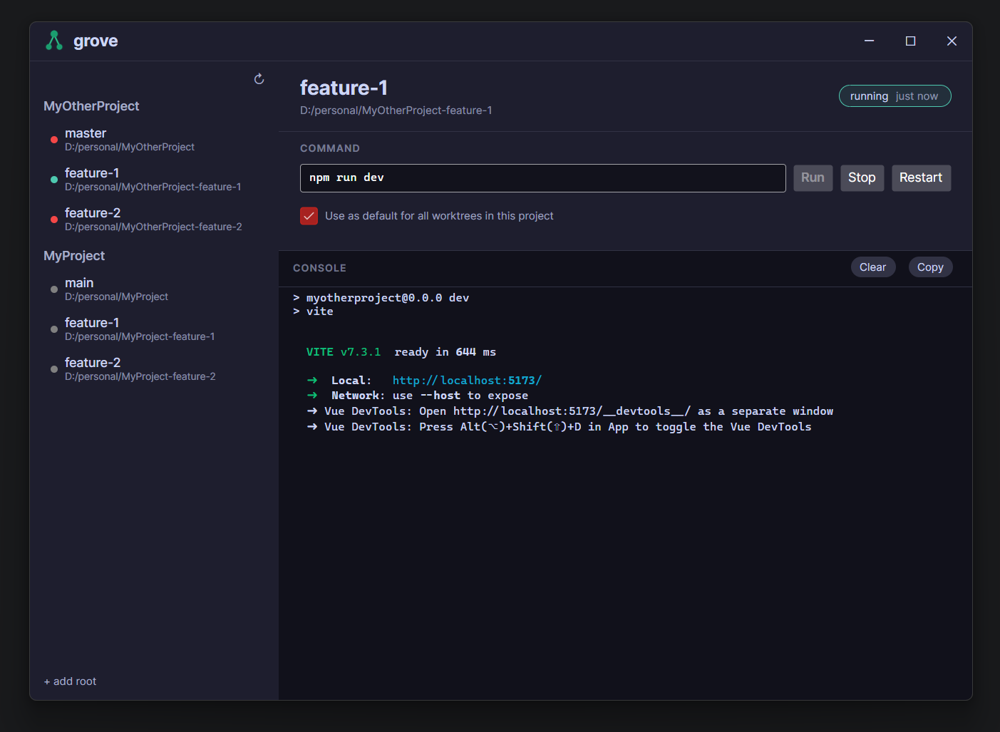

# Grove

**A cross-platform\* git worktree command runner**

###### \* theoretically cross-platform 🤷‍♂️

Now that it's so easy to create tools for ultra specific first world problems, I solved one of my own. I was tired of [z](https://www.powershellgallery.com/packages/z/1.1.14)'ing around between worktrees to visually test new features once an agent had finished its tasks, so I (we?) built this tool.

Grove is a desktop app that finds all git worktrees for a repo and lets you run commands in each one from a single window. Click a branch, hit run, watch the output. Click another branch, hit run, watch that output too. No more "wait, which terminal was `feat/auth` in again?"

## What it does

- **Discovers worktrees** — point it at a repo and it finds every worktree via `git worktree list`
- **Runs commands per worktree** — configure `npm run dev`, `dotnet run`, `cargo watch`, whatever — per branch
- **Live console output** — stdout/stderr streamed in real time, right there in the panel
- **Keeps running in the background** — close the window, processes keep going, tray icon tells you what's up
- **Command presets** — save your common commands, one-click to load them

## Install

Grab the latest release from [Releases](../../releases), unzip, run `Grove.exe`. That's it — it's self-contained, no .NET install needed.

## Tech

Built with C# / .NET 10 / [Avalonia UI](https://avaloniaui.net/). Cross-platform in theory, tested on Windows in practice.

## License

[MIT](LICENSE)
